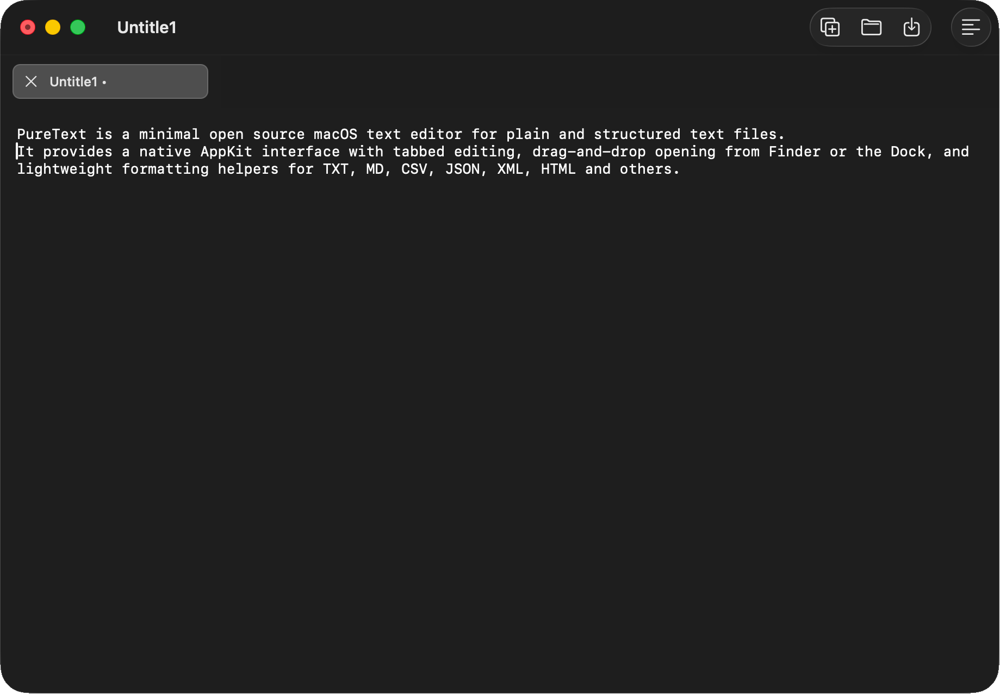

# PureText

PureText is a minimal open source macOS text editor for plain and structured text files. It provides a native AppKit interface with tabbed editing, drag-and-drop opening from Finder or the Dock, and lightweight formatting helpers for TXT, MD, CSV, JSON, XML, HTML and others.

## Screenshot

<p align="center">
  
</p>

## Download

Download the latest prebuilt ZIP from the repository's **GitHub Releases** page and extract `PureText.app` to use PureText without building it locally.

**Quick steps**

1. Open the repository's **Releases** page
2. Download the latest `PureText-<version>-macOS.zip`
3. Extract the archive
4. Move `PureText.app` to `Applications`

End users do not need Xcode or a local Swift toolchain.

## Project Goal

The project aims to offer a small, focused editor for unformatted text on macOS without introducing rich text behavior, project management, or external runtime dependencies.

## Architecture

- Framework: AppKit
- Language: Swift
- Build system: Swift Package Manager for development, plus a packaging script for generating a `.app` bundle

## Features

- Open and edit `.txt`, `.md`, `.csv`, `.yml`, `.bru`, `.pom`, `.json`, `.ljson`, `.xml`, and `.html` files
- Open files by launching the app, using the File menu, or dragging supported files onto the Dock icon
- One file per tab, with close controls directly in the tab strip
- Automatic untitled tabs named `Untitle1`, `Untitle2`, and so on
- Plain-text editing with undo support
- Native search and replace actions from the Edit menu
- Recent files list in the File menu
- View menu toggle for showing tabs, enters, and linefeeds in the editor
- Selection transforms for uppercase, lowercase, and proper case
- File-type-aware formatting for JSON, LJSON, XML, HTML, and POM
- Light and dark appearance support based on the current macOS setting
- Basic document state handling for unsaved changes

## Requirements

- macOS 13.0 or later
- Xcode 26.3 or later recommended
- Swift 6.2.4 or later recommended

The minimum macOS version is defined in `Package.swift` and `App/Info.plist`.

## Getting Started

### Download a prebuilt app

If you only want to use PureText, download the latest ZIP from the repository's **GitHub Releases** page and extract `PureText.app`.

The release workflow builds the app on GitHub-hosted macOS runners and publishes a ready-to-run archive.

### Clone the repository

```bash
git clone https://github.com/<your-account>/PureText.git
cd PureText
```

### Open in Xcode

This repository does not use an `.xcodeproj` file. Open the Swift package directly:

1. Open Xcode.
2. Choose **File > Open...**
3. Select the repository folder or `Package.swift`

Xcode will load the package as a macOS executable target named `PureText`.

### Build and run in Xcode

1. Select the `PureText` scheme.
2. Choose **Product > Run**.
3. The app launches as a standard macOS app window.

### Build from Terminal

To compile and package the app bundle used in local testing:

```bash
./scripts/build_app.sh
```

The generated app bundle is placed in:

```text
.artifacts/PureText.app
```

## Release Build

At the moment, release-style packaging is handled by [`scripts/build_app.sh`](scripts/build_app.sh), [`scripts/package_release.sh`](scripts/package_release.sh), and the GitHub Actions workflow [`.github/workflows/release.yml`](.github/workflows/release.yml). The local scripts:

- compiles the Swift sources with `swiftc`
- generates icon assets from `Assets/PureTextIcon.png`
- assembles `PureText.app` in `.artifacts/`
- packages `PureText.app` into a distributable ZIP archive in `.artifacts/release/`

To create the archive locally:

```bash
./scripts/package_release.sh
```

## GitHub Release Publication

Before publishing a new release on GitHub:

1. Update the user-facing documentation affected by the release.
2. Review `CHANGELOG.md` and move the shipped items out of `Unreleased`.
3. Confirm `App/Info.plist` contains the version that should be published.
4. Optionally refresh screenshots if the interface changed.
5. Validate the package locally with `./scripts/package_release.sh` when practical.

To publish a prebuilt app for users without requiring a local build:

1. Push a tag such as `v0.3.0`
2. Let GitHub Actions run the `Release App` workflow
3. Download or share the generated ZIP from the GitHub Release page

The workflow also supports manual execution through **Actions > Release App > Run workflow**, and manual runs now create or update a GitHub Release using the provided version label or the current `Info.plist` version.

After the workflow finishes:

1. Verify the release title matches the app version.
2. Confirm the asset name follows `PureText-<version>-macOS.zip`.
3. Check that the generated notes or manual summary match the shipped features.
4. Download the ZIP once to confirm the archive expands into `PureText.app`.

If you plan to distribute signed builds outside your machine, you will still need to add your own code signing, notarization, and release automation.

## Initial Configuration

No external packages, environment variables, secrets, or service credentials are required.

The project currently depends only on:

- Xcode or the Xcode Command Line Tools
- macOS system frameworks such as `AppKit` and `UniformTypeIdentifiers`

## Usage Examples

- Create a new untitled tab and start typing plain text
- Find and replace repeated text using the native macOS find interface
- Reopen a recently used file from the File menu
- Toggle visible tabs, enters, and linefeeds from the View menu when inspecting raw text structure
- Convert a selected snippet to uppercase, lowercase, or proper case from the Edit menu
- Open a JSON file and use the Format action to pretty-print objects and keys
- Open an XML or HTML file and normalize indentation by tag structure
- Drag a supported file onto the PureText Dock icon to open it in a new tab
- Work with multiple files in parallel using the custom tab strip

## Supported File Types

| Extension | Open | Save | Format |
| --- | --- | --- | --- |
| `.txt` | Yes | Yes | No |
| `.md` | Yes | Yes | No |
| `.csv` | Yes | Yes | No |
| `.yml` | Yes | Yes | No |
| `.bru` | Yes | Yes | No |
| `.pom` | Yes | Yes | Yes |
| `.json` | Yes | Yes | Yes |
| `.ljson` | Yes | Yes | Yes |
| `.xml` | Yes | Yes | Yes |
| `.html` | Yes | Yes | Yes |

## Contributing

Please read [CONTRIBUTING.md](CONTRIBUTING.md) before opening a pull request.

For changes that affect behavior, include:

- a short explanation of the user impact
- the macOS and Xcode version used for testing
- screenshots or short recordings when the UI changes
- updates to `README.md` and `CHANGELOG.md` when release-facing behavior changes

## License

This repository includes an MIT license in [LICENSE](LICENSE).
